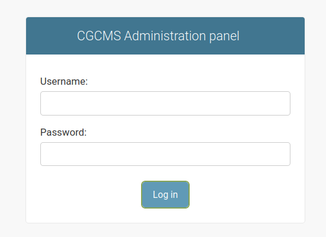
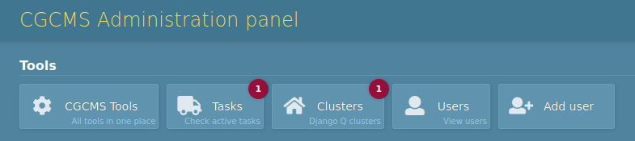
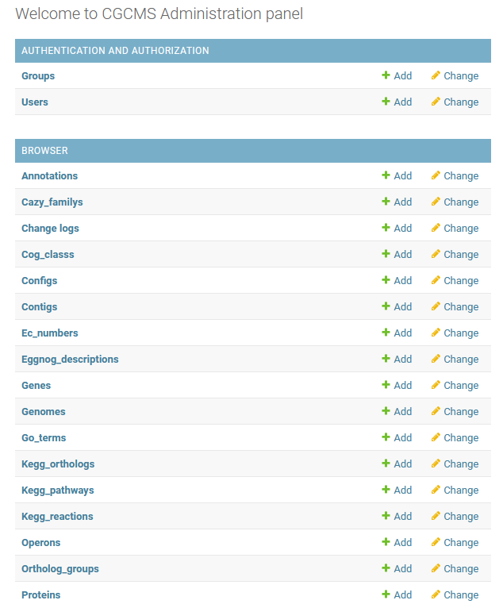
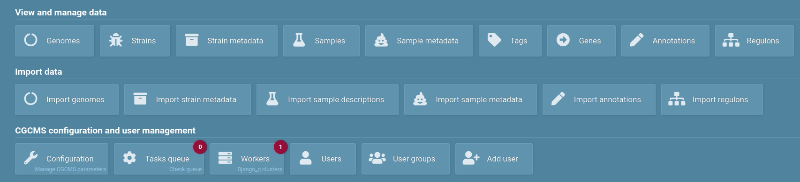
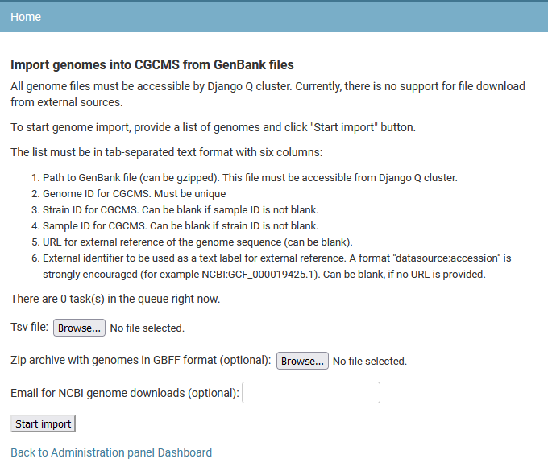
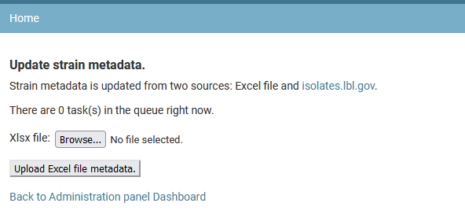
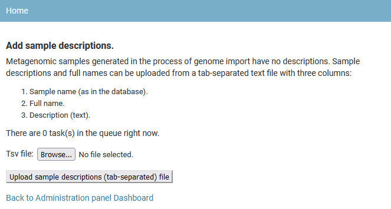
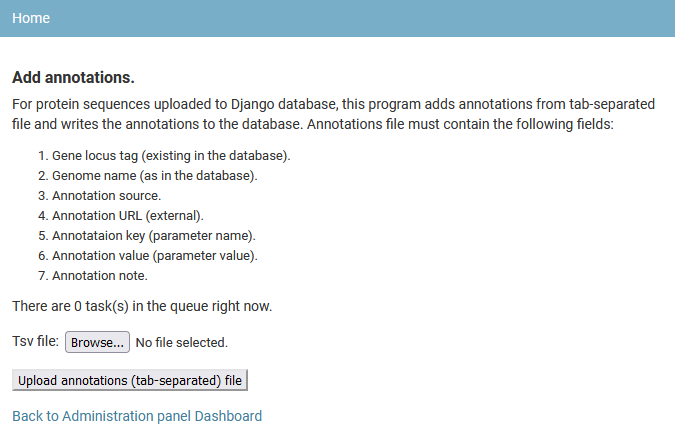
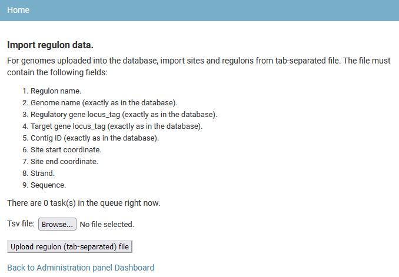
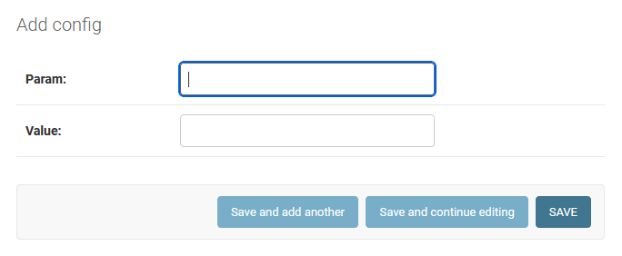

[About](introduction) | [Installation](installation) | [User guide](user) | **Administration guide** | [Developer guide](developer)

# Portal administration guide

There are two ways for administering a GenomeDepot-based web portal: Django’s command-line utility and GenomeDepot administration panel. The command-line utility works in an active virtual environment and supports a limited set of GenomeDepot commands mostly for import and export of large sets of data (see the command-line utility section). The GenomeDepot administration panel provides access to individual data entries and GenomeDepot tools for data import and analysis.

## Log into administration panel



The administration panel link is https://your_site_URL /admin/. Sign in with the superuser username and password created during the GenomeDepot installation.

## Administration portal menu



The tools menu at the top of administration panel pages has five buttons:

* GenomeDepot tools: opens a page with links to GenomeDepot administration tools,
* Tasks: opens a list of queued tasks,
* Clusters: opens a list of Django Q clusters,
* Users: opens a list of GenomeDepot users,
* Add user: opens a form for adding a new user.

## Content management pages

The main page of the administration panel displays a list of content types. You can click on a content type to go to a page that lists all associated records. On those pages, you can view, modify, add or delete records (see the “Managing data in administration panel pages” section). You can also directly click the Add link next to each content type to start creating a record of that type.



## System status

The Tasks and Clusters buttons in the menu of administration panel pages show the number of running clusters and the number of currently active tasks in red circles. These numbers should be either 0 or 1. The number on the Tasks button is 1 if there is a task currently running and 0 if there is no such task. The number on the Clusters button is 1 if the GenomeDepot cluster is up or 0 if there is no running cluster. If this number is larger than 1, additional Django Q clusters have been started. Running several clusters is potentially dangerous for the data integrity and should be avoided.

## Tools page



The tools page has three sections: View and manage data, Import data, GenomeDepot configuration and user management.

The first section contains links to lists of genomes, strains, strain metadata, samples, sample metadata, genome tags, genes, annotations and regulons. These links open tables of existing data.

The second section contains links to import tools for genomes, strain metadata, sample descriptions, sample metadata, gene annotations and regulons. 

The last section on the tools page has the same links as the menu on the administration panel dashboard (see above), with an additional link to the User groups page.

## Use GenomeDepot administration tools for data import

### Add genomes 

GenomeDepot stores genome sequences in GenBank format files and protein sequences in the database. The genome import pipeline generates the genome files and creates database entries for genomes, strains, genes and proteins. The import pipeline also runs EggNOG-mapper to assign proteins to ortholog families and POEM to predict operons. In addition to ortholog families, EggNOG-mapper associates proteins with KEGG orthologs, KEGG reactions, EC numbers, TC families and other functional classifications. 



In the Tools page of the administration panel, click the Import genomes link. Before genome import, prepare input files. There are three ways to import genome files into GenomeDepot:

1. Copy genome files in Genbank format (can be gzipped) to the server’s directory with read permissions for the GenomeDepot user. Make a tab-separated file with six columns:
	* full path of a Genbank file
	* genome ID (can contain letters, digits, dots, hyphens and underscores only)
	* strain ID (can contain letters, digits, dots, hyphens and underscores only)
	* sample ID (can contain letters, digits, dots, hyphens and underscores only) 
	* URL (link to NCBI genome assembly etc., optional)
	* External ID (will be displayed on the genome page. For example, "NCBI:GCF_000006945.2" for NCBI assembly. Keep it short but meaningful.)

	Click the “Browse” button to find and select the tab-separated file for upload. Then press the “Start import” button.

2. Make a zip archive with genome files in Genbank format. Make a tab-separated file with six columns:
	* name of a Genbank file
	* genome ID (can contain letters, digits, dots, hyphens and underscores only)
	* strain ID (can contain letters, digits, dots, hyphens and underscores only)
	* sample ID (can contain letters, digits, dots, hyphens and underscores only) 
	* URL (link to NCBI genome assembly etc., optional)
	* External ID (will be displayed on the genome page. For example, "NCBI:GCF_000006945.2" for NCBI assembly. Make it short but meaningful.)

	Click the “Browse” button to find and select the tab-separated file for upload. Click the next “Browse” button to find and choose a Zip archive with genomes. Then press the “Start import” button.

3. GenomeDepot can download genome assemblies from NCBI over ftp. It can save time, but if internet connection is not stable, downloaded files can be truncated. Make a tab-separated file with six columns:

	* NCBI genome assembly identifier (for example, GCF_000006945.2)
	* genome ID (can contain letters, digits, dots, hyphens and underscores only)
	* strain ID (can contain letters, digits, dots, hyphens and underscores only)
	* sample ID (can contain letters, digits, dots, hyphens and underscores only) 
	* URL (link to NCBI genome assembly etc., optional)
	* External ID (will be displayed on the genome page. For example, "NCBI:GCF_000006945.2" for NCBI assembly. Make it short but meaningful.)

	Click the “Browse” button to find and select the tab-separated file for upload. Enter an email into the text field (the email is not saved by GenomeDepot, it is only used by NCBI e-utils). Then press the “Start import” button.

### Add strain metadata

Upload any organism metadata from an Excel file since the metadata is not collected by the genome import pipeline. The Excel file has to have one spreadsheet with strain identifiers in the leftmost column, metadata categories in the top row and metadata values in other cells. Empty cells and cells containing “None” are ignored. All imported metadata entries have “User-defined data” as a source and display a “No external link” message instead of link to external resource. An alternative method for organism metadata upload is using the command-line command “update_strain_metadata”.




### Add sample descriptions

There are no descriptions in sample entries generated by genome import pipeline for metagenome-assembled genomes. Such descriptions can be uploaded from a tab-separated file with three columns:

* Sample name (as in the database).
* Sample full name.
* Description (text).



### Add sample metadata

Sample metadata is not collected from genome files by the genome import pipeline, so users have to upload it later from a tab-separated file. The file must have five columns:

* Sample name (as in the database).
* Metadata source.
* Metadata URL (link to external resource).
* Metadata key (category name).
* Metadata value.


### Add gene annotations

Users can upload additional annotations for any gene in the database. A tab-separated file with annotations must contain seven columns fields:

* Gene locus tag (as in the database).
* Genome name (as in the database).
* Annotation source (name of a tool producing the annotation, a database, etc. Up to 30 symbols long).
* Annotation URL (link to external resource. Up to 300 symbols long).
* Annotation key (Short category name, like “Protein family” or “Domain”. Up to 30 symbols long).
* Annotation value (For example, identifier of a protein family or domain. Up to 50 symbols long).
* Annotation note (free-text description).



### Add regulons

Regulons and sites can be uploaded from a tab-separated file. Each line in the file describes a regulatory interaction between a regulatory gene, a target gene and a binding site. A regulon groups together regulatory interactions for a single regulatory protein. The input file must contain the nine fields:

* Regulon name.
* Genome name (exactly as in the database)
* Regulatory gene locus_tag (exactly as in the database)
* Target gene locus_tag (exactly as in the database)
* Contig ID (exactly as in the database)
* Site start position
* Site end position
* Site strand
* Site sequence

If the target gene is the first gene in an operon, the site will be linked to this operon when imported.



## Managing users

Click the Add user button in the administration panel menu to add a new user with administration permissions. Users can have permissions to view, add or edit the data, manage other user accounts, view, add or delete tasks in the jobs queue etc. You can find more about Django administration panel in this tutorial: https://developer.mozilla.org/en-US/docs/Learn/Server-side/Django/Admin_site

## Managing data in administration panel pages

Use administration panel pages to view, modify, add or delete data records. A page displays a list of records of a certain type. 

To add a record, click an Add link in the top right part of the page.

To delete one or more records, select the records by clicking on checkboxes, choose the Delete action from the dropdown Actions menu and press Go.

To modify a record, click on it. Make the changes in the edit page for the record, then press SAVE, Save and add another, or Save and continue editing to save the record. 

Records of many content types are auto-generated during genome import and do not need human intervention. Other content types (for example, regulons, gene annotations or strain and sample metadata records) have specialized tools for data import. So, only some content types are described in detail in this section: configuration parameters, genomes and tags.

## Configuration parameters (configs)

View configuration parameters path: admin/browser/config/

To modify a configuration parameter, click on its name, change its properties and press the save button. Param is a parameter name, Value is a parameter value.

Add configuration parameter path: admin/browser/config/add/



## Genomes

View genomes path: admin/browser/genome/

Click on the Add genome link opens the genomes import tool (see “Use GenomeDepot administration tools for data import”).

Commands available from the Actions menu for genomes

Delete genomes: select genomes in the list, choose “Delete genomes” in the Actions list and press “Go”. This action correctly deletes all genes, operons and sites associated with the deleted genomes and re-builds nucleotide and protein BLAST databases. Do not use the “Delete” button in the genome change page.

Run annotation tools: select genomes in the list, choose “Run annotation tools” in the Actions list and press “Go”. In the new window, check the tools to run and press “Start tools”. 

Add genome tag: select genomes in the list, choose “Add a tag” in the Actions list and press “Go”. In the new window, choose a tag from the dropdown menu and press “Change”. 

Remove genome tag: select genomes in the list, choose “Remove a tag” in the Actions list and press “Go”. In the new window, choose a tag from the dropdown menu and press “Change”. 

Update static files and re-build search databases: this command re-creates the files for the interactive genome viewer for selected genomes and completely re-builds nucleotide and protein BLAST databases.

## Genome tags

Upon genome import, a tag “imported” with the import date is auto-generated for a batch of the genomes processed. To add another tag, click the Add tag link on the Tags page (admin/browser/tag/). On the add page, enter a name and a description of the new tag, choose a background color and a text color, then click SAVE. A tag can be associated with genomes using Add genome tag action in the Genomes administration page.

## GenomeDepot command-line utility

In addition to the administration panel, GenomeDepot uses Django’s command-line utility for administration tasks. This utility is particularly useful for adding, deleting or changing multiple records at a time. The utility can be used even when the Apache web server was stopped. Before using the command-line utility, deactivate all conda environments (if any) and activate GenomeDepot virtual environment:
```
conda deactivate
source /path/to/genomedepot/genomedepot-venv/bin/activate
cd /path/to/genomedepot/apps/mygenomes/genome-depot/genomebrowser
```
then run
```
python manage.py <command> [parameters]
```
where command should be one of the commands listed in this document; parameters can be zero or more of the parameters available for that command.

### Available commands
```
python manage.py delete_all_data
```
Deletes all data records from the GenomeDepot database except configuration parameters. Once deleted, the data cannot be restored. This command does not delete static genome files.
```
python manage.py delete_all_genomes
```
Deletes **all** Annotation, Gene, Protein, Genome, Strain, Sample records from the database.
```
python manage.py delete_genome [-g]
```
Deletes one genome with all genes and annotations from the database.

Parameters:
*  **-g** Genome name

```
python manage.py delete_genomes [-i]
```
Deletes one or more genomes with all genes and annotations from the database

Parameters:
* **-i** File with a list of genome names

```
python manage.py export_config [-o]
```
Exports configuration parameters into a text file with key/value entries separated by "=" symbol

Parameters:
* **-o** Output file name

```
python manage.py export_genomes [-g] [-o]
```
Export genomes with all gene annotations in Genbank format

Parameters:
* **-g** Comma-separated list of genome names
* **-o** Output file name

```
python manage.py generate_static_files [-i]
```
Generates genome viewer static files for genomes from the input file and re-creates search databases

Parameters:
* **-i** File with a list of genome names

```
python manage.py import_annotations [-i]
```
Imports annotations for protein-coding genes from a tab-separated file and writes the annotations into the GenomeDepot database. The genes must be in the database.
The input file with annotations must have seven fields:


* Gene locus tag (as in the database).
* Genome name (as in the database).
* Annotation source.
* Annotation URL (external).
* Annotation key.
* Annotation value.
* Annotation note.

Parameters:

* **-i** Input file name

```
python manage.py import_config [-i] [--overwrite]
```
Imports settings from a config file (text file with key/value entries separated by "=" symbol)

Parameters:

* **-i** Input file name
* **--overwrite** If config parameter exists, overwrite its value (default: false)

```
python manage.py import_genome_descriptions [-i]
```
Updates descriptions of existing genome records and/or genome names. 
The input file must contain the following fields:

* Genome name (as in the database).
* New genome name (same as [1] if no change needed).
* Description text.
* External URL.
* External ID.

Parameters:

* **-i** Input file name

```
python manage.py import_genomes [-i]
```
Imports genomes from Genbank files. The files must be in the local file system. 
The input file must have six tab-separated fields:

* Full path to a Genbank file
* genome name (no spaces or special symbols)
* strain name (no spaces or special symbols, can be blank)
* sample name (no spaces, can be blank)
* External URL (link to NCBI genome assembly etc.)
* External identifier (for example, "NCBI:GCF_000006945.2")

Parameters:

* **-i** Input file name

```
python manage.py import_regulons [-i]
```
Imports regulons from a tab-separated file. Genomes must be uploaded into the GenomeDepot database before running this command. 
The input file must contain the following fields:

* Regulon name.
* Genome name  (as in the database).
* Regulatory gene locus_tag.
* Target gene locus_tag.
* Contig ID (as in the database).
* Site start.
* Site end.
* Site strand.
* Site sequence.

Parameters:

* **-i** Input file name

```
python manage.py import_sample_descriptions [-i]
```
For metagenomic samples uploaded into the Django database, this program changes sample descriptions.
The input file must contain the following fields (tab-separated):

* Sample name (as in the database).
* Full name.
* Description text

Parameters:

* **-i** Input file name

```
python manage.py import_sample_metadata [-i]
```
Imports sample metadata from tab-separated file into the Django database. Sample records must be created before running this program.
The input file must contain the following fields:

* Sample name (as in the database).
* Metadata source.
* Metadata URL (external).
* Metadata key.
* Metadata value.

Parameters:

* **-i** Input file name

```
python manage.py import_strain_metadata [-i]
```
Imports strain metadata records from Excel spreadsheet and from isolates.genomics.lbl.gov API. The spreadsheet must contain strain identifiers in the first column and names of metadata categories in the first row. All other non-empty cells will be considered values.

Parameters:

* **-i** Input file name

```
python manage.py recreate_genome_viewer [-g]
```
Deletes and re-creates static files for one genome.

Parameters:

* **-g** Genome name

```
python manage.py recreate_search_databases
```
Removes and re-generates nucleotide and protein search databases. Use it if the files are missing or corrupted, or if the genome import pipeline crashed before creating the search database files.

```
python manage.py run_annotation_pipeline [-i] [-t/--all]
```
For protein-coding genes from input genomes, this command runs one or more annotation tools.     Existing annotations for these tools in the input genomes will be deleted.
Input is either a file with list of genome names or a tab-separated file with six columns:

* path to Genbank file
* genome ID (no spaces)
* strain name (no spaces)
* sample ID (no spaces)
* External URL (link to NCBI genome assembly etc.)
* External ID (for example, "NCBI:GCF_000006945.2")

Parameters:

* **-i** Input file name
* **-t** Comma-separated list of annotation tool plugins
* **--all** Ignore -t parameter and run all annotation tools

```
python manage.py update_tags [-i] [-t]
```
Assigns one or more tags to genomes listed in a text or a tab-separated file. For the format of the input file, see description of the run_annotation_pipeline command.

Parameters:

* **-i** Input file name
* **-t** Comma-separated list of tags

```
python manage.py update_taxonomy
```
Updates taxonomy with new data downloaded from NCBI. 


[Continue to developer guide...](developer)

[About](introduction) | [Installation](installation) | [User guide](user) | **Administration guide** | [Developer guide](developer)
