[About](introduction) | [Installation](installation) | **User guide** | [Administration guide](admin) | [Developer guide](developer)

# User guide

## Concepts, general description

Genome is a complete or partial assembly of genomic sequences of a particular organism. Genome can include one or several contiguous nucleotide sequences, or contigs. Genomes can represent cultured microbial isolates or uncultured organisms from metagenomic samples.

Strain in GenomeDepot is an organism cultivated under controlled laboratory conditions, typically in the absence of other species. There can be more than one genome of a strain, if several versions of a genome assembly are available.

Sample is a metagenomic data set representing multiple members of a microbial community. Metagenome-assembled genomes (MAGs) are linked to samples.

Gene in GenomeDepot is a continuous DNA segment, typically with assigned function. Genes can be coding or non-coding. Coding genes are linked to proteins. Non-coding genes are usually either rRNA and tRNA genes or pseudogenes.

Regulon is a group of genes (or operons) that are directly regulated by a DNA-binding transcription factor, which recognizes binding sites upstream of those genes. 

## Start page

The start page is a main entry point for a GenomeDepot-based web site. The start page contains eight links:

* List of genomes
* List of strains
* List of samples
* Text search 
* Nucleotide sequence search
* Protein sequence search
* About page with site statistics
* Link to GenomeDepot documentation site

[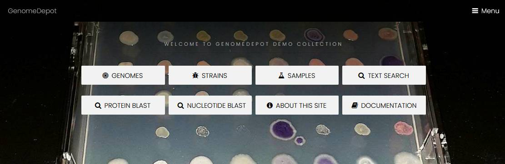](assets/images/startpage.jpg)

The menu button in the top right corner of the start page opens a menu with the same eight links, and also a link switching between dark and bright modes. You can find the menu button on every page of the site.

## Genome list

The page with a list of genomes has a search field, a sunburst chart of genomes taxonomy, and a table of genomes. The search field helps site visitors to find a genome by name or by metadata. The search is case-insensitive.

[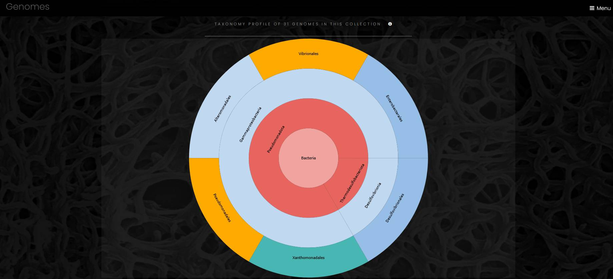](assets/images/sunburst.jpg)

The sunburst chart visualizes taxonomy data spanning outwards radially from the root node. It shows four levels of taxonomy, and a click on a sector outside of the taxon label puts this taxon to the center of the chart and opens additional children taxa, if any. A click on the central circle makes one step up in taxonomical hierarchy. A click on a taxon’s label opens a page of the taxon. Outermost sectors display genomes, and a click on the label of a genome sector opens a page of the genome in a new browser tab.

[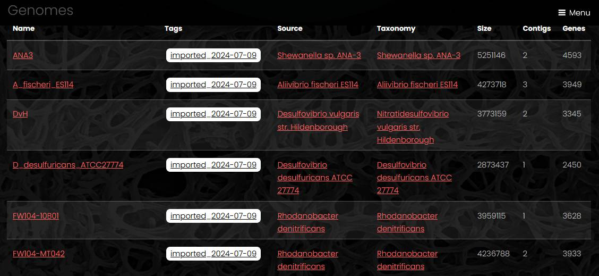](assets/images/genomelist.jpg)

The list of genomes displays genome name, genome tags, strain name, taxon name, genome size, number of contigs and number of genes. A link under the table exports full genome list with additional fileds as a tab-separated file.

## Genome

Genome pages have four parts: genome information, interactive genome viewer, search fields and data download. The information section has links to the strain page, list of genes, list of operons, hierarchical list of taxa with links to each taxon page and a link to the source sequence file.

[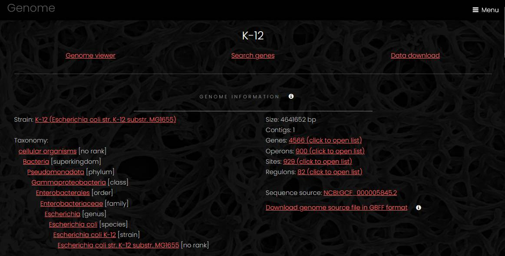](assets/images/genomepagetop.jpg)

The genome viewer section shows embedded Jbrowse genome browser with reference sequence track and four feature tracks (CDSs, operons, pseudogenes and RNA genes). A click on a feature opens feature details widget that has a link to the feature page in the Name field. In the genome viewer, visitors can scroll a contig side to side using your mouse wheel or via click and drag. The zoom buttons and the slider bar found in the header of the linear genome view can be used to zoom in and out on the view. Visitors can switch between contigs using dropdown menu.

[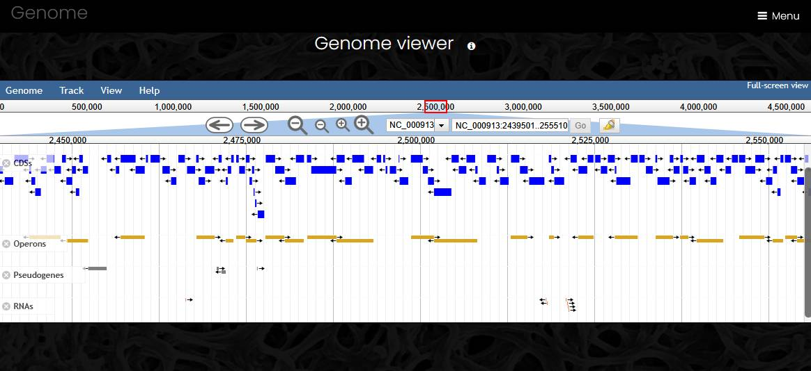](assets/images/genomeviewer.jpg)

In the search section, site visitors can look for genes in the genome by name, locus tag, functional annotation, or use one of functional classifications to filter the gene list.

Three buttons in the download section generate a GenBank format file with all annotations, export a table of genes as tab-separated file, or export all protein sequences in FASTA format.

## Gene

Gene pages have four sections: gene information, genome viewer, functional annotations and analysis tools. The gene information section contains links to eggNOG families at different taxonomic levels, links to conserved genome neighborhood visualizations and general information about the gene.

The genome viewer section is similar to the viewer section of the genome page but with the current gene highlighted. 

The functional annotations section shows annotations generated by eggNOG-mapper in the left column and annotations generated by other tools in the right column. The former includes KEGG pathways, reactions, and orthologs, Gene Ontology labels, EC numbers, TCDB families, CAZy terms and COG functional classes. The latter includes Pfam protein domains, TIGRFAM families, antimicrobial resistance families, secondary metabolism biosynthetic genes, phage defense systems, microbial secretion system genes  etc. 

[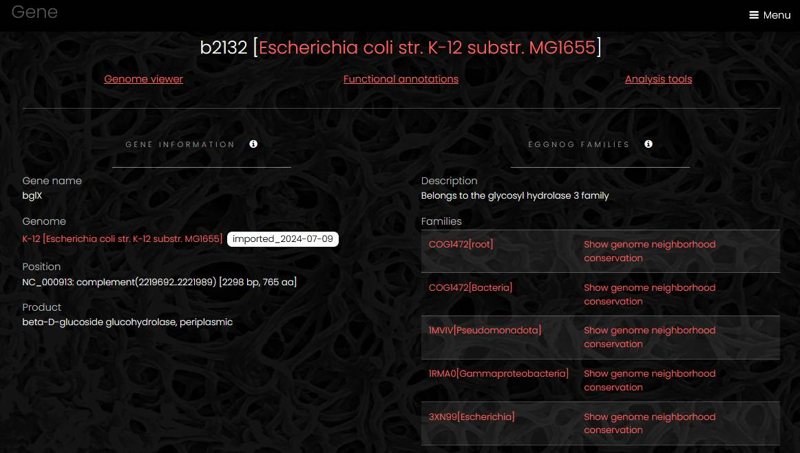](assets/images/genepage.jpg)

The analysis tools section contains links to external sequence analysis tools for prediction of signal peptides and transmembrane segments, protein domain mapping and similarity search in sequence databases.

## Ortholog family

Proteins are assigned to ortholog families by eggNOG-mapper, and all ortholog families keep eggNOG database identifiers. 

An eggNOG family page has a link to a list of all genes in the family, a taxonomy profile of the family members and functional profile of the family. 

[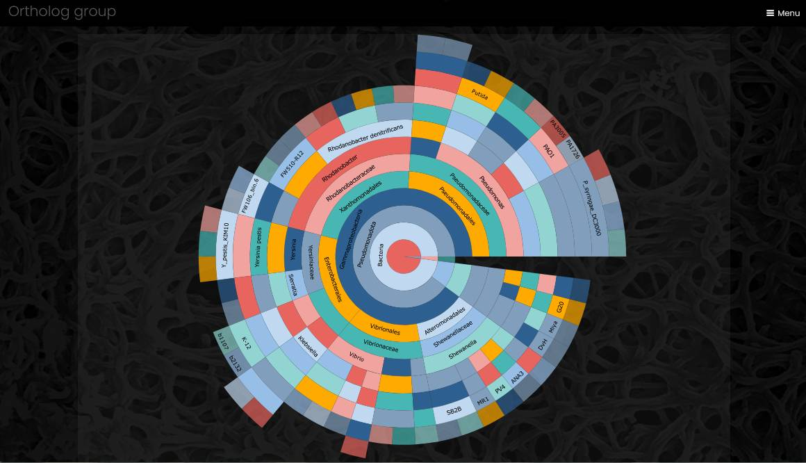](assets/images/eggnogsunburst.jpg)

The taxonomy profile is a sunburst chart visualizing taxonomy data spanning outwards radially from the root node. It is similar to the genome taxonomy profile, but the outermost sectors of the chart contain genes, and a click on gene name opens the gene page.

[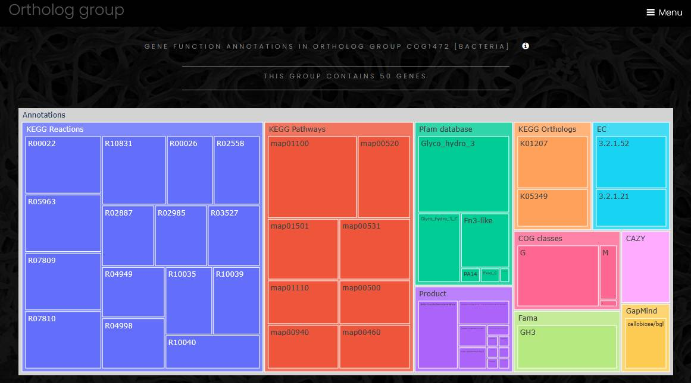](assets/images/eggnogfunctions.jpg)

The functional profile of ortholog family is a treemap chart composed of nested rectangles. The highest level of the functional profile shows functional classifications and functional annotation sources, and lower level of the profile shows functional categories. The size of a category rectangle corresponds to the number of genes in that category. Functional profiles can be exported as tab-separated text file.

## Gene conserved neighborhood

A page for comparative analysis of genome neighborhood displays a region around a selected gene and several orthologs from a chosen eggNOG family. User can change the number of orthologs (up to 200 genes) and the size of the genome region (up to 100 kbp).  There are several steps in the conserved gene neighborhood analysis. At the first step, the selected protein is compared to all members of the selected eggNOG family using Smith-Waterman sequence alignment algorithm, which selects 10-200 most similar proteins. At the next step, Muscle calculates multiple sequence alignment of the selected proteins, and a neighbor-joining phylogenetic tree is calculated from the multiple sequence alignment. At the final step, the selected genomes are arranged according to the order of sequences in the phylogenetic tree, a database search identifies neighbor genes of each protein-coding gene on the tree, and a color is assigned to each gene according to eggNOG family at the highest taxonomic level available. The starting gene and its orthologs always have red color, and genes that have no eggNOG ortholog mappings are always marked grey. A protein tree to the left from the genome neighborhood chart shows phylogenetic relationships of the orthologs. Users can display the phylogenetic tree in the Newick format by clicking on a link at the bottom of the page. This page also contains a treemap chart with functional profile of all displayed genes in the genome neighborhood in all the genomes. 

[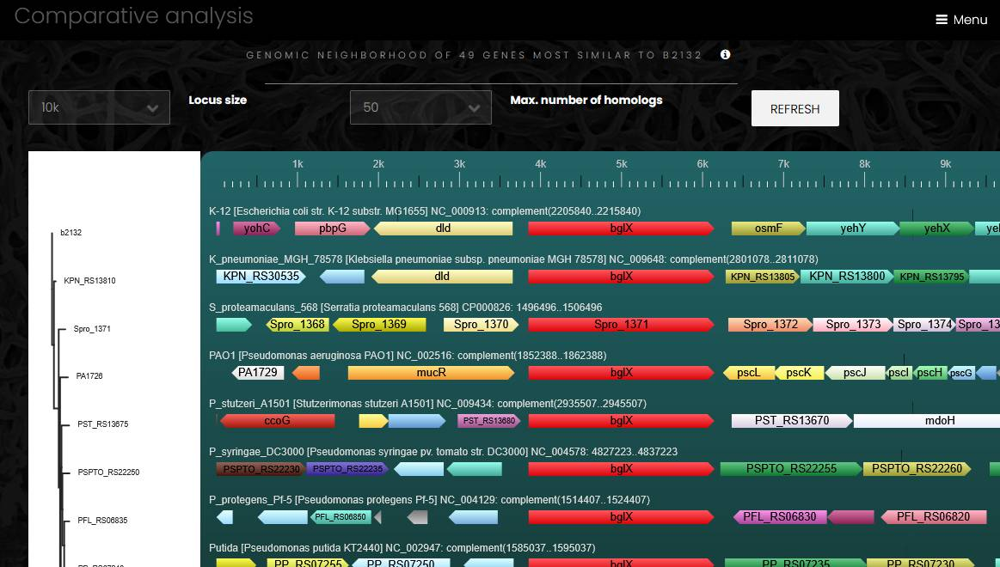](assets/images/neighborhood.jpg)

## Strain and Sample

A strain page contains list of genomes associated with the strain, taxonomy information and strain metadata entries (if any). The metadata entries a grouped by source. Similarly, a sample page contains list of genomes associated with the sample, description of the sample and sample metadata entries.

[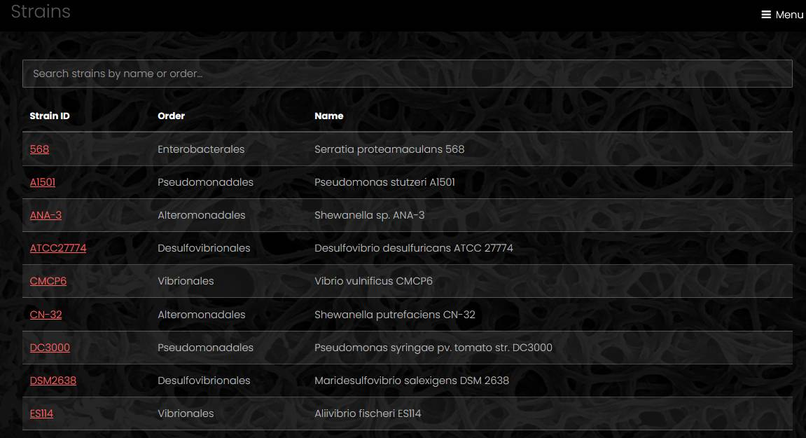](assets/images/strainlist.jpg)

## Taxon

A taxon page contains a sunburst chart for taxonomic profile of all genomes associated with the taxon, list of the genomes and list of strains from the taxon.

[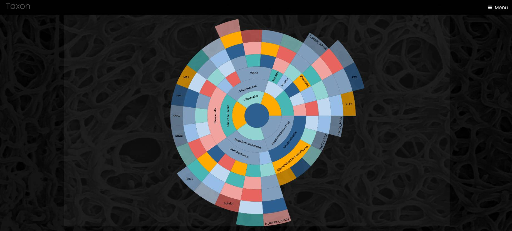](assets/images/taxon.jpg)

## Text search

The text search page has text fields for search of genes by name or function, search in functional classifications and search in taxonomy. The search in genes by name first tries to find a unique exact match to a locus tag, and if there is no such match, it proceeds with a search in gene names, genome names and contig names. Next to each search field for functional classifications, there is a link that displays a full list of the functional classes.

[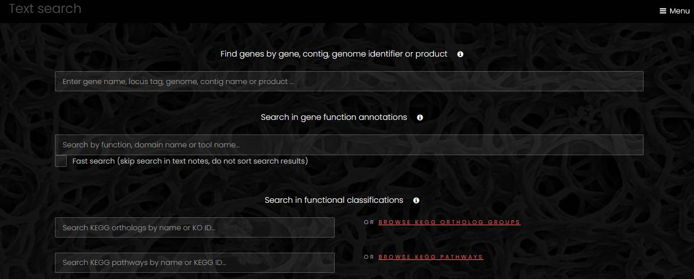](assets/images/textsearchfull.jpg)

## Functional classifications

The genome import pipeline of GenomeDepot maps protein-coding genes to eight functional classifications using eggnog-mapper:

* KEGG Ortholog groups

* KEGG pathways

* KEGG reactions

* Enzyme families (EC)

* Transporter families (TCDB)

* CAZy families

* COG classes

* GO terms

A search in functional classifications returns matches in names and descriptions of the functional classes. In the search results page, a link from the name of a functional class opens a page with a list of genes mapped to that class.

A search from a genome page only returns genes mapped to functional classes in that genome. Links to lists of functional classes on a genome page return only the functional classes mapped to the genes of that genome.

## KEGG pathway maps

A search for KEGG pathways from a genome page returns a list of pathways identified in that genome. To show genes of a KEGG pathway on the pathway's map, click on KEGG ID of a pathway of interest. Next page will contain a list of gnes mapped to the pathway, with a link for KEGG map at the top of the page

[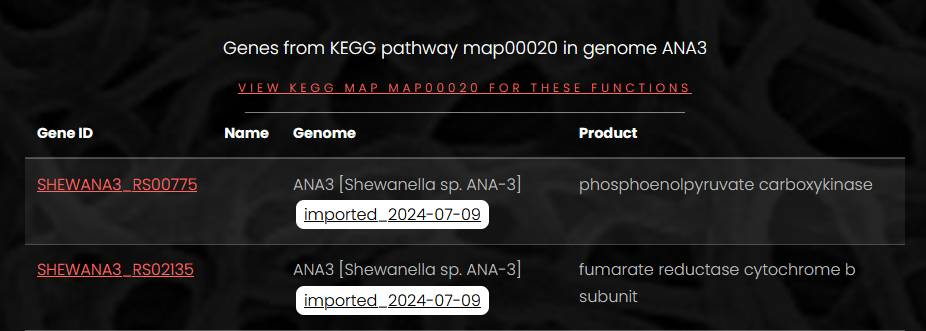](assets/images/pathwaysearch.jpg)

A click on the map link opens a page with a list of KEGG ortholog groups and genes on the left side. On the right side, a map of the pathway is loaded from the KEGG web-site. On the pathway map, colors of EC numbers correspond to colors of KEGG ortholog groups in the list. If an EC number on the map corresponds to more than one KEGG ortholog group, only one color is shown. Hover mouse pointer over the EC number on the map to display full list of KEGG ortholog groups mapped to this enzyme activity.

Since KEGG maps are loaded from the external web-site, this page requires web-access to the KEGG web-site to work properly. The loading speed of KEGG map web-page may vary.

## Sequence search

Pages for search by nucleotide or protein sequence have the text area for query sequence and dropdown lists for E-value threshold and maximum number of hits to display. The query sequence must be in the FASTA format, without leading spaces and empty lines. The protein sequence similarity search uses BLASTP, and the nucleotide sequence similarity search uses megablast. The page of protein search results displays link to the hit gene, genome name, %identity, alignment length, query coverage %, E-value and bit-score. The page of nucleotide search results displays link to the hit sequence, genome name, %identity, alignment length, query coverage %, E-value and bit-score. A click on the nucleotide search hit opens a genome page with the hit region highlighted.

[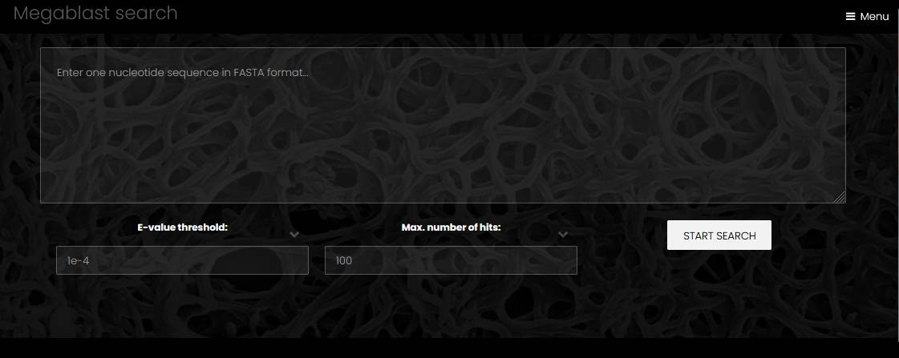](assets/images/nuclsearch.jpg)

## Operon

An operon page has three or four sections: operon information section, list of genes, list of sites (if any) and interactive genome viewer. The information section contains link to the genome page, sequence name with operon start and end positions and a link to conserved operon page. The list of genes contains name, position and product of all operon members. The genome viewer displays the genome with the operon region highlighted.

[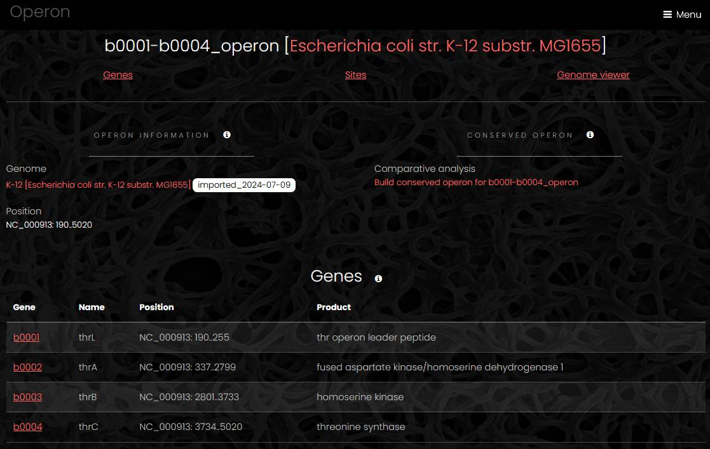](assets/images/operon.jpg)

## Conserved operon

A conserved operon app displays the result of operon comparative analysis. To build a conserved operon, at first, the app selects an eggNOG family for each gene in the operon at the lowest taxonomic level, so only closest homologs are selected for the analysis. Next, a database search identifies all operons that include members of the selected eggNOG families. Genes from these operons are collected for functional profiling. The resulting conserved operon page has three parts: taxonomic profile, functional profile and a list of operons. The taxonomic profile is a sunburst chart similar to the chart on the genomes list page with operons or genes in outermost sectors. The functional profile is a treemap chart displaying functional annotations of all genes in the conserved operon. The operon list contains links to all operons and all genomes in the conserved operon with the location and the number of genes for each operon.

[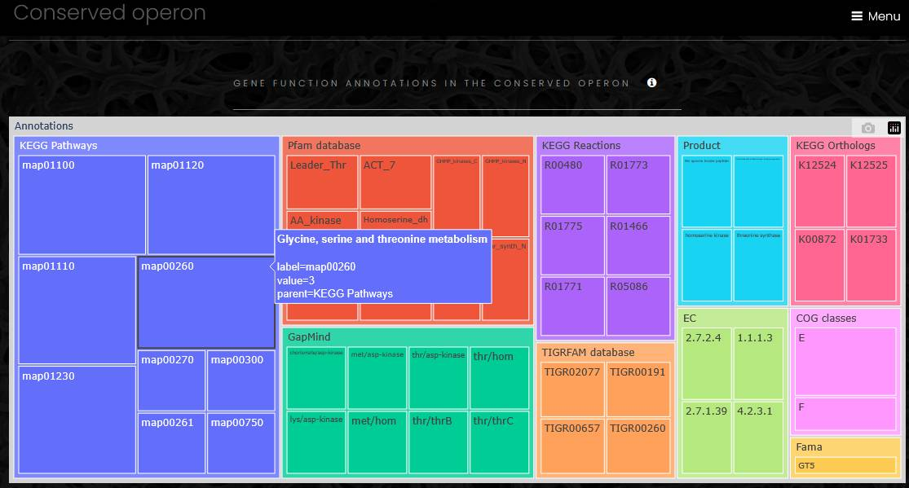](assets/images/funcprofile.jpg)

## Regulon

A regulon page has four sections: regulon information, a list of sites, a list of operons and a list of genes. The regulon information section contains a regulon description and links to the genome page, regulatory protein page and conserved regulon analysis app. The list of sites displays for every site a link to site page, site position, sequence and a link to target gene or operon page. The list of genes displays a link to the gene page, gene name, position and product for each target gene, which is not a member of an operon. The list of target operons displays a link to the operon page, operon position and list of genes in the operon.

[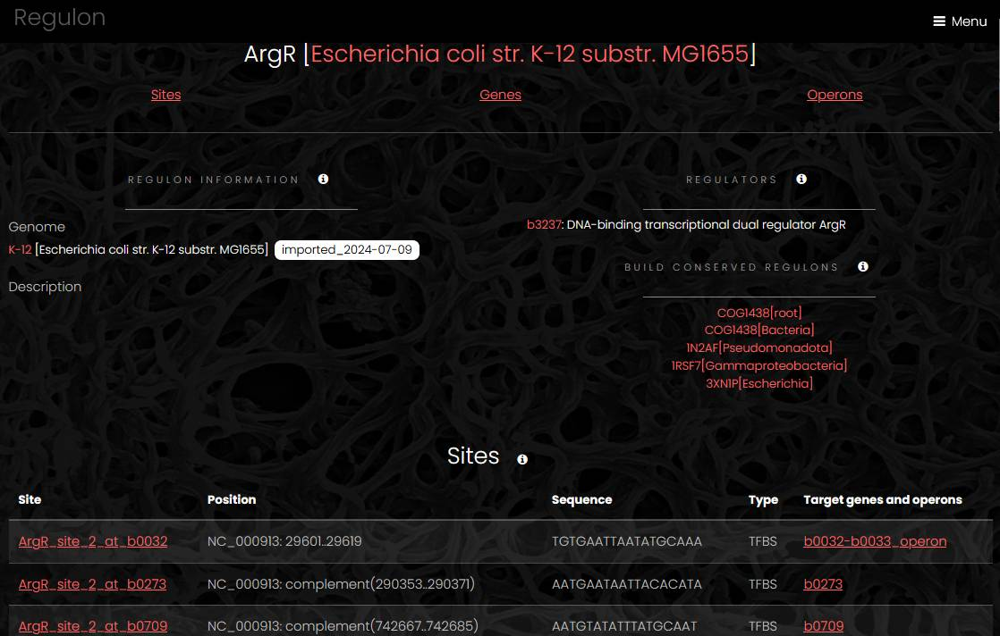](assets/images/regulon.jpg)

## Conserved regulon

A conserved regulon app displays the result of comparative regulon analysis. Regulons controlled by regulatory proteins from the same eggNOG family constitute a conserved regulon. Since a regulatory protein can belong to more than one eggNOG family at different taxonomic levels, several conserved regulons can be constructed for one regulatory protein. The conserved regulon page has four sections. The regulator section shows a list of gene products in a selected eggNOG family and a link to the list of all eggNOG family members. The comparative table section displays eggNOG families in rows and regulons in columns. The cells marked orange show number of target genes from an eggNOG family in a regulon. The regulons section contains links to regulons and regulatory genes included into the conserved regulon. The sites section contains list of all sites from all regulons included into the conserved regulon.

[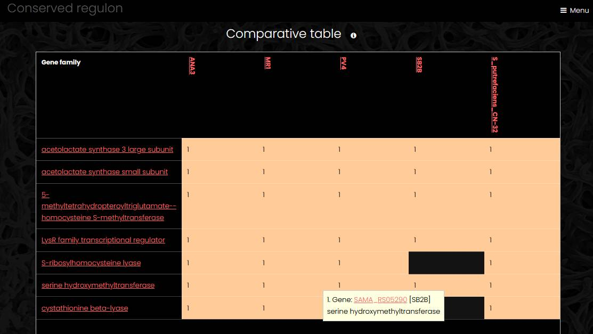](assets/images/cons_regulon.jpg)

## Site

A site page has three sections. The site information section contains site coordinates, site sequence and a link to the genome page. The target operons section displays a link to the operon page, operon position and a list of genes for each target operon. The genome viewer section displays the genome with the site highlighted.

[Continue to administration guide...](admin)

[About](introduction) | [Installation](installation) | **User guide** | [Administration guide](admin) | [Developer guide](developer)
